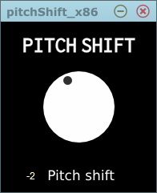

# simple pitch shift plugin .

this plugin's pitch shift algorism is **sound touch** open source library .

SoundTouch Audio Processing Library : ( http://www.surina.net/soundtouch/ )

## screen shot

screen shot in juce plugin demo app.

## download

Releases : https://github.com/kawaCat/pitchShifter-Vst/releases

## note

* one Parameter and one Program.
* +- 1 octave change width.
* vst 2.4 plugin.
* win 32 ,64bit.
